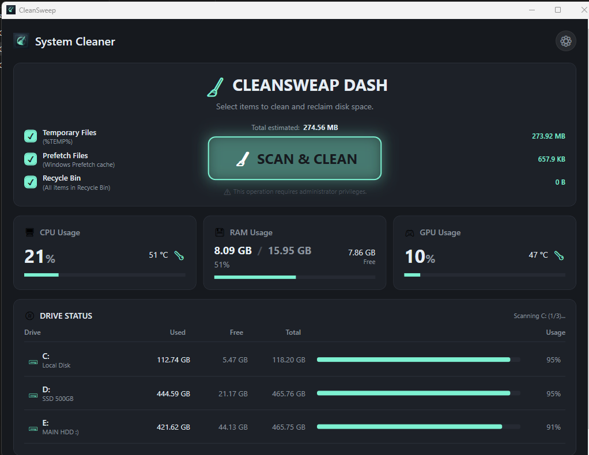
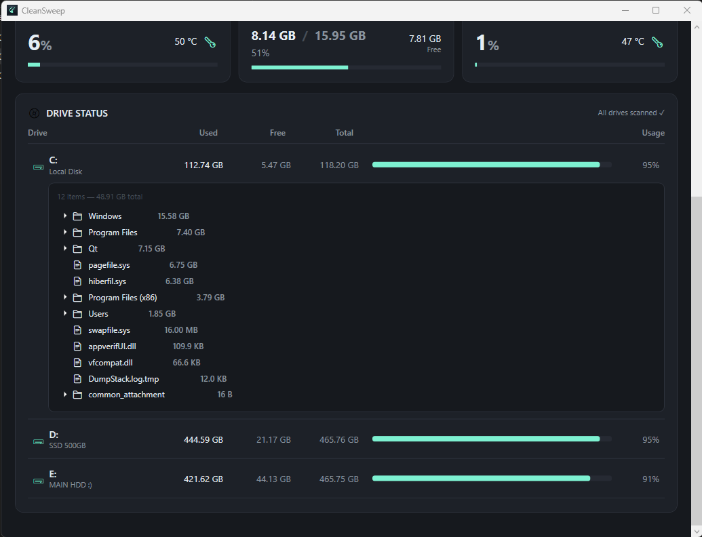
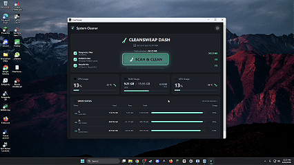

  
  <h1>🧹 CleanSweep v1.0</h1>
  
<strong>A powerful, open-source system cleaner and disk analyzer for Windows.</strong>

  

    
    
    
  

---

## 📖 Overview

**CleanSweep** is a modern, lightweight system utility designed to keep your Windows machine running smoothly. It safely removes temporary files, clears the prefetch cache, and empties your Recycle Bin to reclaim valuable disk space. With real-time system monitoring and an integrated disk analyzer, you always know exactly what's consuming your storage and system resources.

Built with a beautiful, dark-themed UI and liquid glass animations, CleanSweep proves that system utilities don't have to be boring.

---

## ✨ Features

- **🗑️ Smart Cleaning**: Quickly and safely remove unnecessary files from `%TEMP%`, Windows Prefetch, and the Recycle Bin.
- **📊 Real-time Monitoring**: Keep an eye on your CPU usage, RAM utilization, and GPU performance right from the dashboard.
- **💿 Disk Analyzer**: View an interactive breakdown of your drives to see exactly which folders and files are taking up the most space.
- **🎨 Modern Design**: Enjoy a premium interface featuring a dark mode aesthetic, smooth animations, and a responsive layout.
- **⚡ Lightweight**: Optimized for performance with minimal background resource usage.

---

## 🚀 Installation

CleanSweep uses a tiny, self-contained web installer that automatically fetches the latest version.

1. Head over to the [Releases page](https://github.com/Md-Saim/CleanSweep/releases/latest).
2. Download `CleanSweepSetup.exe`.
3. Run the installer and follow the on-screen wizard.
4. *(Optional)* A desktop shortcut will be created for easy access.

---

## 📸 Screenshots

To add screenshots, simply place your image files in an `assets` folder in the root of the repository with the names listed below.

| Dashboard & Monitoring | Settings & About |
| :---: | :---: |
|  |  |

| Disk Analyzer | Liquid Glass Button |
| :---: | :---: |
|  |  |

---

## 🛠️ Technologies Used

CleanSweep is built using modern Windows development frameworks and tools:

- **C# / .NET 8**: The core logic and performance-critical operations.
- **WPF (Windows Presentation Foundation)**: For building the rich, dynamic user interface.
- **CommunityToolkit.Mvvm**: To maintain a clean Model-View-ViewModel architecture.
- **WMI & System.Diagnostics**: For real-time hardware monitoring (CPU, RAM, GPU).

---

## 🤝 Contributing

Contributions, issues, and feature requests are welcome!  
Feel free to check out the [issues page](https://github.com/Md-Saim/CleanSweep/issues).

1. Fork the Project
2. Create your Feature Branch (`git checkout -b feature/AmazingFeature`)
3. Commit your Changes (`git commit -m 'Add some AmazingFeature'`)
4. Push to the Branch (`git push origin feature/AmazingFeature`)
5. Open a Pull Request

---

## 📝 License

Distributed under the MIT License. See `LICENSE` for more information.
